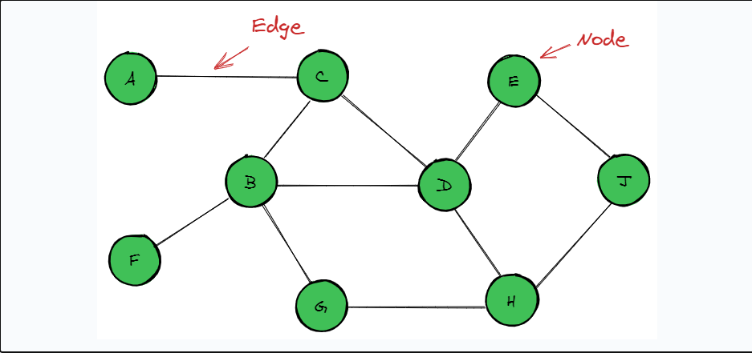
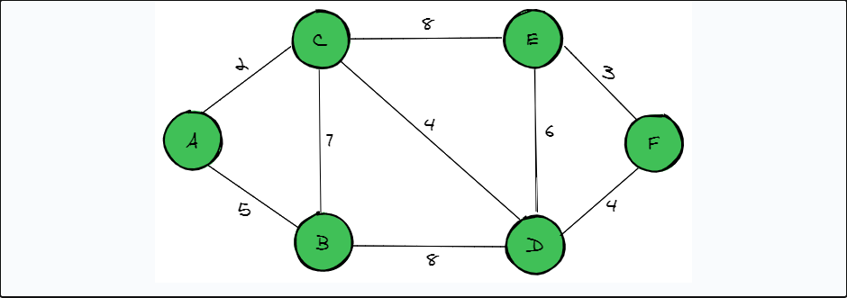
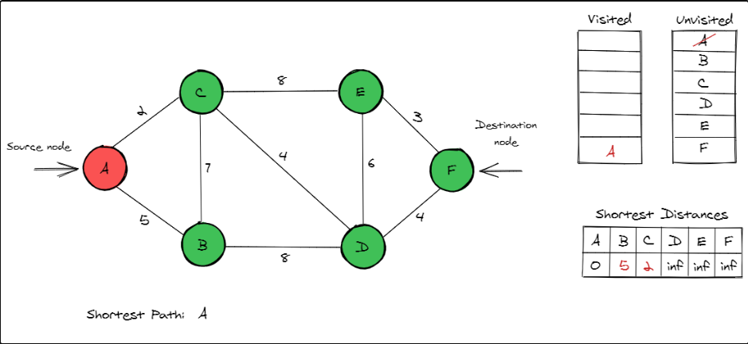
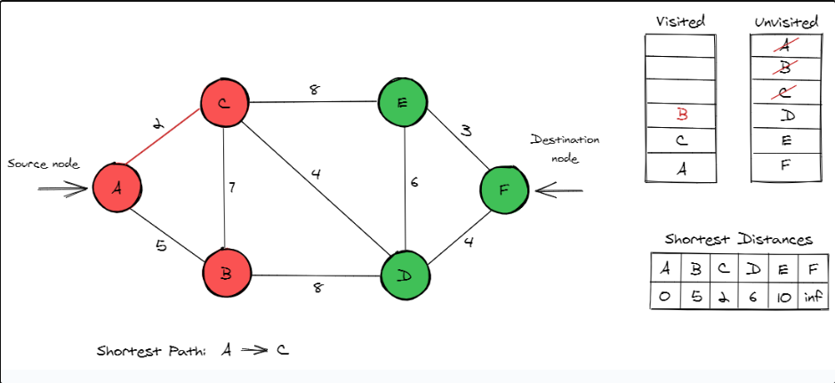
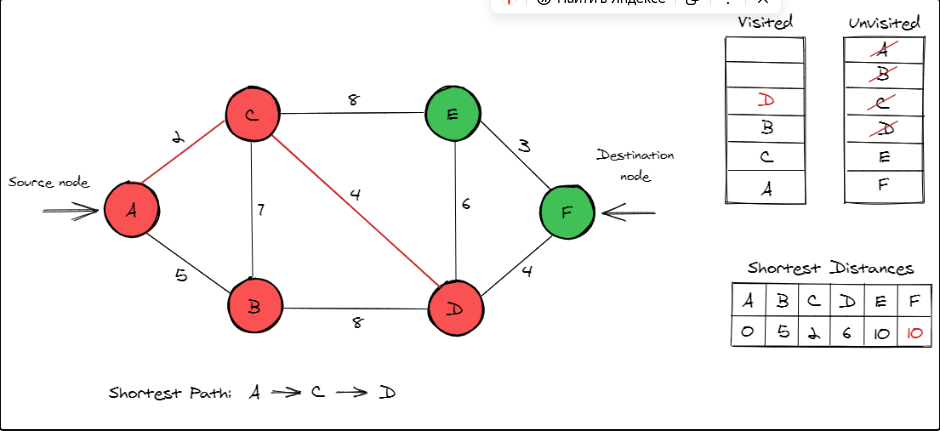
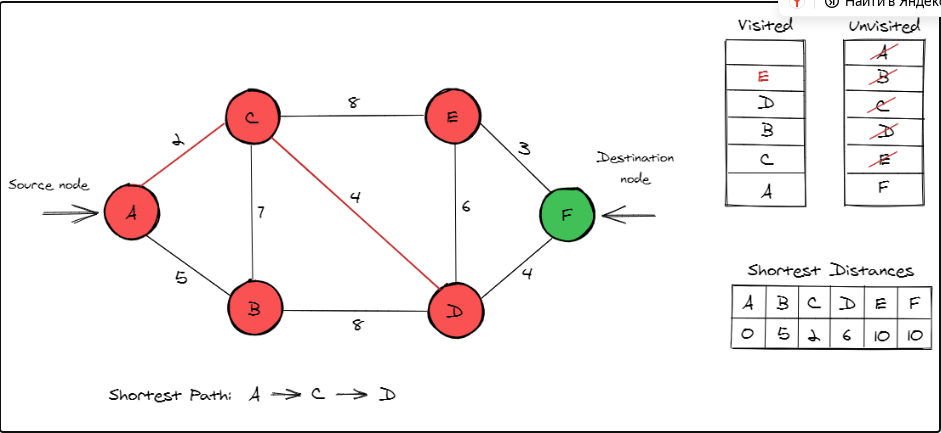
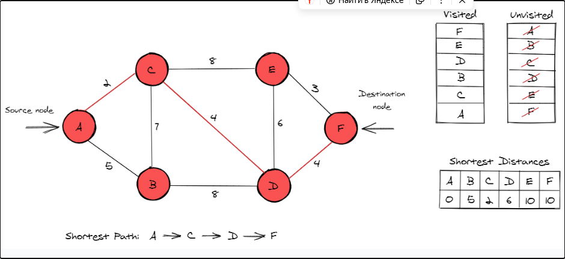

# Алгоритм Дейкстры

### Представление задачи

Задачи на поиск кратчайшего пути представлены в виде графа. В задачах на поиск кратчайшего пути nodes обозначают города (или точки), а edges — связи, или соединения, между ними, как показано ниже. В таких задачах может быть один или несколько source nodes узлов, от которых определяются пути. Эту задачу можно представить как с помощью directed-графов, так и с помощью undirected-графов.


### Алгоритм

Алгоритм Дейкстры требует, чтобы во входном графе был только один исходный узел. Кроме того, все рёбра в графе должны иметь неотрицательные веса.

Предположим, нам дали карту, подобную приведенной ниже, и мы хотим путешествовать от city A к city F. На простом графике, подобном этому, мы можем видеть, что существует несколько путей для перемещения от A к F.


Давайте подробно разберем алгоритм, инициализировав некоторые переменные, необходимые для алгоритма Дейкстры. Нам понадобятся следующие:

- Список всех unvisited узлов графа.

- Список distances с их узлами в графе. Сначала расстояние до всех узлов инициализируется как infinity, кроме исходного узла (для которого оно инициализируется как 0).

- Список всех узлов, которые являются visited, и которые образуют shortest path. Сначала в этом списке будет только исходный узел.

Алгоритм начинается с исходного узла, которым в данном случае является A. Мы изменяем расстояния между узлами B и C в списке расстояний на 5 и 2. Поскольку сумма значений расстояний от исходного узла до узлов B и C больше исходного расстояния, они изменяются. График и соответствующие списки выглядят так, как показано ниже.


Теперь мы движемся к непосещённому узлу с наименьшим расстоянием — узлу C. Расстояния до узлов D и E теперь равны 6 и 10.

Поскольку сумма расстояний от исходного узла до узлов D и E больше исходного расстояния, данные были обновлены.

В случае с узлом D расстояние от A до C равно 2, а от C до D — 4. Таким образом, общее расстояние от исходного узла до D составило 2 + 4 = 6.

Узел E был обновлен таким же образом. Поскольку C на данный момент является кратчайшим путем, он добавляется к кратчайшему пути. Изменения реализованы так, как показано ниже.


Непосещенный узел с наименьшим значением расстояния теперь равен B. Поскольку посещение B не открывает новых путей, значения расстояния до узлов остаются неизменными, и этот узел также не добавляется в путь. B теперь перемещается в список узлов visited .


Теперь D — это непосещённый узел с наименьшим значением расстояния. Посетив узел D, мы находим новое соединение F и обновляем его значение расстояния до 2 + 4 + 4 = 10. Это значение добавляется к кратчайшему пути, так как узел D обеспечивает кратчайший путь от предыдущего узла C.


Теперь у узлов E и F одинаковые значения расстояния. Двигаясь в лексикографическом порядке, мы сначала посетим узел E. Это не увеличивает длину кратчайшего пути и не меняет значения расстояния между узлами.


Последний узел, который нам нужно посетить, — это F, который также является нашим конечным узлом. Теперь кратчайший путь найден: нужно добавить путь от узла D до F. Общий вес этого кратчайшего пути равен 10. Все остальные пути, ведущие к конечному узлу F, будут длиннее, чем 10.


### Реализация

Давайте реализуем этот алгоритм. Граф можно представить по-разному, но в этом руководстве мы представим его в виде adjacency list (вложенных словарей).

В этой реализации у нас есть исходный узел, конечный узел, а пример графа представлен следующим образом:

```go
graph := map[string]map[string]int{
	"a": {"b": 5, "c": 2},
	"b": {"a": 5, "c": 7, "d": 8},
	"c": {"a": 2, "b": 7, "d": 4, "e": 8},
	"d": {"b": 8, "c": 4, "e": 6, "f": 4},
	"e": {"c": 8, "d": 6, "f": 3},
	"f": {"e": 3, "d": 4},
}

source := "a"
destination := "f"
```

Теперь инициализированы списки непосещенных узлов, путей и расстояний. Все начальные значения расстояний для всех узлов равны бесконечности, кроме исходного узла, для которого значение равно нулю.

```go
package main

import "fmt"
import "math"

func main() {
    graph := map[string]map[string]float64{
        "a": {"b": 5, "c": 2},
        "b": {"a": 5, "c": 7, "d": 8},
        "c": {"a": 2, "b": 7, "d": 4,"e": 8},
        "d": {"b": 8, "c": 4, "e": 6, "f": 4},
        "e": {"c": 8, "d": 6, "f": 3},
        "f": {"e": 3, "d": 4},
    }
    source, destination := "a", "f"
    shortestDistances := make(map[string]float64)
    pathNodes := make(map[string]string)
    for node, _ := range graph {
        shortestDistances[node] = math.Inf(1)
    }
    // set distance of source to 0
    shortestDistances[source] = 0
}
```

Это основная часть алгоритма. Выбирается unvisited узел с наименьшим расстоянием до исходного узла. Затем проверяются все neighboring узлы, связанные с этим узлом, и расстояния между ними обновляются. Узлы добавляются в список пути при каждом обновлении расстояния. Этот процесс повторяется до тех пор, пока не будут проверены все узлы графа visited.

```go
package main

import "fmt"

const inf = int(^uint(0) >> 1)

func main() {
    graph := map[string]map[string]int{
        "a": {"b": 5, "c": 2},
        "b": {"a": 5, "c": 7, "d": 8},
        "c": {"a": 2, "b": 7, "d": 4, "e": 8},
        "d": {"b": 8, "c": 4, "e": 6, "f": 4},
        "e": {"c": 8, "d": 6, "f": 3},
        "f": {"e": 3, "d": 4},
    }

    source := "a"
    destination := "f"

    shortestDistances := make(map[string]int)
    pathNodes := make(map[string]string)

    for node := range graph {
        shortestDistances[node] = inf
    }
    shortestDistances[source] = 0

	for len(graph) > 0 {
		minNode := ""
		minVal := inf
		for node := range graph {
			if shortestDistances[node] < minVal {
				minVal = shortestDistances[node]
				minNode = node
			}
		}
		for neighbor, value := range graph[minNode] {
			alternativeValue := shortestDistances[minNode] + value
			if alternativeValue < shortestDistances[neighbor] {
				shortestDistances[neighbor] = alternativeValue
				pathNodes[neighbor] = minNode
			}
		}
		delete(graph, minNode)
	}
}
```

Чтобы получить путь shortest , мы также проверяем, можно ли добраться до узла destination из узла source, поскольку существует вероятность, что это невозможно. Затем целевой узел добавляется в список маршрутов, что позволяет найти кратчайший путь.

```go
shortestDistances := make(map[string]int)
pathNodes := make(map[string]string)
unvisited := make([]string, len(graph))
copy(unvisited, graph)

for _, node := range unvisited {
    shortestDistances[node] = math.MaxInt32
}
shortestDistances[source] = 0

for len(unvisited) > 0 {
    minNode := ""
    for _, node := range unvisited {
        if minNode == "" || shortestDistances[minNode] > shortestDistances[node] {
            minNode = node
        }
    }

    for node, value := range graph[minNode] {
        if value+shortestDistances[minNode] < shortestDistances[node] {
            shortestDistances[node] = value + shortestDistances[minNode]
            pathNodes[node] = minNode
        }
    }
    unvisited = remove(unvisited, minNode)
    node := destination
    route := []string{}
    for node != source {
        if _, ok := pathNodes[node]; ok {
            route = append([]string{node}, route...)
            node = pathNodes[node]
        } else {
            fmt.Println("Path not reachable")
            break
        }
    }
    route = append([]string{source}, route...)
}
```

Алгоритм Дейкстры требует значительного вычислительного времени. Временная сложность в общем случае равна O(V2), где V - количество вершин. Это значение улучшается до O (E log V) (где E - количество ребер), если представление графа изменено на adjacency lists. Хотя polynomial time сложность, такая как O (V2), может показаться высокой, это лучше, чем алгоритмы грубой силы, которые обеспечивают гораздо большее время вычислений.
