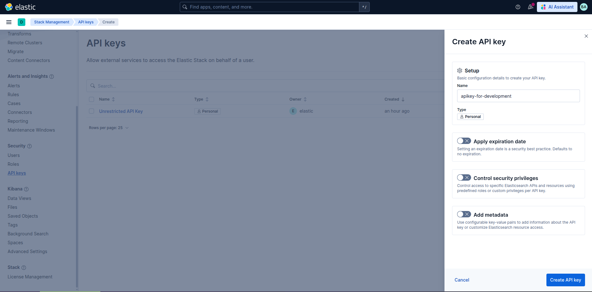
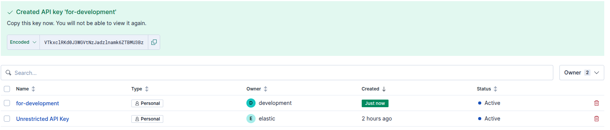

# Некоторые особенности настройки доступа к Elasticsearch

Подробнее можно узнать по ссылке https://www.elastic.co/docs/reference/elasticsearch/clients/go/getting-started#_connecting

Ставим go пакет для взаимодействия с Elasticsearch

```bash
go get github.com/elastic/go-elasticsearch/v9@latest
```

Можно выполнить авторизацию в СУБД Elasticsearch с использованием логина и пароля или с помощью ранее созданного API-Key. Пример создания API-Key ниже

В результате будет создан ключ

