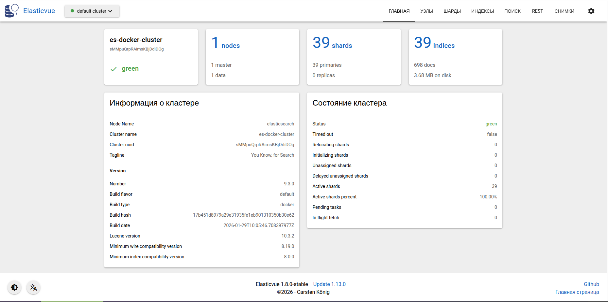

# Elasticsearch image

## Настройка авторизации

### Генерирование временных паролей для авторизации Kibana в Elasticsearch

Пароли генерируются для переменных окружения

- ELASTICSEARCH_USERNAME=kibana_system
- ELASTICSEARCH_PASSWORD=

Для того что бы сгенерировать в Elasticsearch временные пароли нужно выполнить следующие команды

```bash
docker compose up -d elasticsearch
docker exec -it elasticsearch bash
```

далее внутри контейнера выполнить

```bash
bin/elasticsearch-setup-passwords auto
```

будет сгенерирован список паролей для определённого набора пользователей. Список паролей аналогичен списку в файле _tmp_elasticsearch_credentials_.
Так же более подробную информацию можно получить по ссылке https://www.elastic.co/docs/deploy-manage/security/set-up-minimal-security

### Настройка Elasticvue

Elasticvue представляет собой минималистичный веб интерфейс для управления кластерами Elasticsearch. Пример ниже


Добавить в настройку переменных окружения Elasticsearch следующие параметры:

- http.cors.enabled=true
- http.cors.allow-origin=http://localhost:8484
- http.cors.allow-headers=X-Requested-With,Content-Type,Content-Length,Authorization
- http.cors.allow-credentials=true
