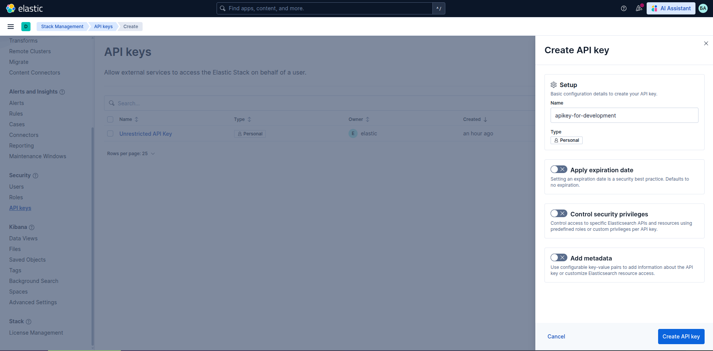
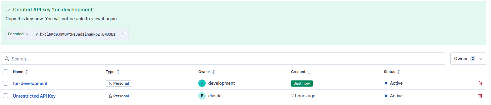

# Некоторые особенности настройки доступа к Elasticsearch

Подробнее можно узнать по ссылке https://www.elastic.co/docs/reference/elasticsearch/clients/go/getting-started#_connecting

Ставим go пакет для взаимодействия с Elasticsearch

```bash
go get github.com/elastic/go-elasticsearch/v9@latest
```

Можно выполнить авторизацию в СУБД Elasticsearch с использованием логина и пароля или с помощью ранее созданного API-Key. Пример создания API-Key ниже

В результате будет создан ключ


Подробное описание формирования запросов к Elasticsearch можно посмотреть по ссылке https://www.elastic.co/docs/reference/elasticsearch/rest-apis

Здесь более подробено рассказано о языке запросов **Query DSL** https://www.elastic.co/docs/explore-analyze/query-filter/languages/querydsl

```bash
curl -X PUT "http://localhost:9200/_snapshot/migration_repo" \
  -u "a.belyakov:${ESPASS}" \
  -H "Content-Type: application/json" \
  -d '{
    "type": "fs",
    "settings": {
      "location": "/root/snapshot/",
      "compress": true,
      "chunk_size": "1g",
      "max_snapshot_bytes_per_sec": "50mb",
      "max_restore_bytes_per_sec": "100mb"
    }
  }'
```
