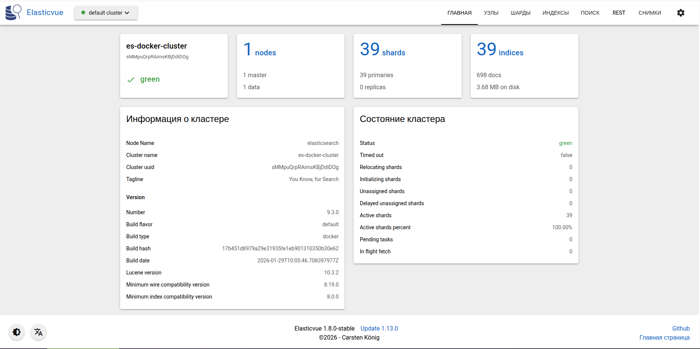

# Elasticsearch image

## Настройка авторизации

### Генерирование временных паролей для авторизации Kibana в Elasticsearch

Пароли генерируются для переменных окружения

- ELASTICSEARCH_USERNAME=kibana_system
- ELASTICSEARCH_PASSWORD=

Для того что бы сгенерировать в Elasticsearch временные пароли нужно выполнить следующие команды

```bash
docker compose up -d elasticsearch
docker exec -it elasticsearch bash
```

далее внутри контейнера выполнить

```bash
bin/elasticsearch-setup-passwords auto
```

будет сгенерирован список паролей для определённого набора пользователей. Список паролей аналогичен списку в файле _tmp_elasticsearch_credentials_. Для просмотра сгенерированных пароле в docker elasticsearch, выполняем:

```bash
docker inspect <elasticsearch_container_id> | grep -i password
```

Так же более подробную информацию можно получить по ссылке https://www.elastic.co/docs/deploy-manage/security/set-up-minimal-security

### Настройка Elasticvue

Elasticvue представляет собой минималистичный веб интерфейс для управления кластерами Elasticsearch. Пример ниже


Добавить в настройку переменных окружения Elasticsearch следующие параметры:

- http.cors.enabled=true
- http.cors.allow-origin=http://localhost:8484
- http.cors.allow-headers=X-Requested-With,Content-Type,Content-Length,Authorization
- http.cors.allow-credentials=true

### Настройка снапшотов для создания бекапов в MinIO

Перед запуском контейнеров docker нужно создать публичный ключ и сертификат

```bash
./gencerts.sh
```

Для начала надо настроить Elasticsearch-источника. Добавляем учетные данные MinIO в keystore. Elasticsearch использует защищенный keystore для хранения чувствительных данных. Выполняем следующие команды:

```bash
docker exec -it <source_container_id> bash
# Добавьте Access Key и Secret Key
bin/elasticsearch-keystore add s3.client.default.access_key
bin/elasticsearch-keystore add s3.client.default.secret_key
# Здесь default — это дефолтное имя клиента, которое вы будете использовать при регистрации репозитория
```

после добавления access и secret нужно сделать:

```bash
docker compose restart <source_container_id>
```

что бы просмотреть список существующих учетных данных выполняем:

```bash
bin/elasticsearch-keystore list
```

То есть если в настройках MinIO есть MINIO_ROOT_USER=minioadmin, то это же имя нужно использовать в строке s3.client.<имя клиента>.access_key и s3.client.<имя клиента>.secret_key. По терминологии MinIO access_key - username, secret_key - password.

Далее нужно выполнить:

```bash
curl -u elastic:jYQ758IbxEnXxF3SM0T0 -X PUT 'http://localhost:9200/_snapshot/my-minio-snapshot' -H 'Content-type: application/json' -d '{
  "type": "s3",
  "settings": {
    "bucket": "my-backup",
    "client": "default",
    "endpoint": "https://minio:9000",
    "protocol": "https",
    "path_style_access": true,
    "region": "us-east-1",
    "readonly": false,
    "disable_chunked_encoding": true
  }
}'
#    "endpoint": "https://192.168.9.53:9900",
```

Должен быть получен ответ:

```json
{ "acknowledged": true }
```

Если получаем ощибку типа "repository_verification_exception", то проблеммы с авторизационными данными (неверный логин или пароль) или что более вероятно публичный сертификат не был добавлен в хранилище сертификатов elasticsearch.

Создаем снапшот всех индексов и глобального состояния кластера:

```bash
curl -u elastic:jYQ758IbxEnXxF3SM0T0 -X PUT 'http://localhost:9200/_snapshot/my-minio-snapshot/snapshot_1?wait_for_completion=true'
```

параметр **wait_for_completion=true** позволяет дождатся завершения выполнения задачи.

Проверяем наличие снапшота:

```bash
curl -u elastic:jYQ758IbxEnXxF3SM0T0 -X POST "http://localhost:9200/_snapshot/my-minio-snapshot/_verify?pretty"
```

Посмотрим все имеющиеся снапшоты:

```bash
curl -u elastic:jYQ758IbxEnXxF3SM0T0 -X GET "http://localhost:9200/_snapshot/my-minio-snapshot/_all?pretty"
```

Так можно посмотреть информацию о конкретном индексе:

```bash
curl -u elastic:jYQ758IbxEnXxF3SM0T0 -X GET "http://localhost:9200/testtt.module_placeholderdb_alert_rcmnvs_2026_7?pretty"
```

Смотрим количество документов в индексе:

```bash
curl -u elastic:jYQ758IbxEnXxF3SM0T0 -X GET "http://localhost:9200/logs.placeholder_doc-base-db_july_2026/_count?pretty"
```

Проверка данных. Ищем первые 10 документов в индексе:

```bash
curl -u elastic:jYQ758IbxEnXxF3SM0T0 -X GET "http://localhost:9200/testtt.module_placeholderdb_alert_rcmnvs_2026_7/_search?pretty" \
  -H "Content-Type: application/json" \
  -d '{
    "query": {
      "match_all": {}
    },
    "size": 10
  }'
```

Посмотреть все существующие индексы:

```bash
curl -u elastic:2nPERtdYz1RYgawe8sI4 -X GET "http://localhost:9211/_cat/indices?v&pretty"
```

На новом Elasticsearch, на который выполняется миграция данных со старого нужно зарегистрировать репозиторий MInIO:

```bash
curl -u elastic:2nPERtdYz1RYgawe8sI4 -X PUT 'http://localhost:9211/_snapshot/my-minio-snapshot' -H 'Content-type: application/json' -d '{
  "type": "s3",
  "settings": {
    "bucket": "my-backup",
    "client": "default",
    "endpoint": "https://minio:9000",
    "protocol": "https",
    "path_style_access": true,
    "region": "us-east-1",
    "readonly": false,
    "disable_chunked_encoding": true
  }
}'
#  "endpoint": "https://192.168.9.53:9900",

curl -u elastic:2nPERtdYz1RYgawe8sI4 -X PUT 'http://localhost:9211/_snapshot/my-minio-snapshot' -H 'Content-type: application/json' -d '{
  "type": "s3",
  "settings": {
    "bucket": "my-backup",
    "client": "default",
    "endpoint": "https://192.168.9.53:9900",
    "protocol": "https",
    "path_style_access": true,
    "region": "us-east-1",
    "readonly": false,
    "disable_chunked_encoding": true
  }
}'
```

Можно удалить все существующие индексы или удалить только пользовательские индексы:

```bash
curl -u elastic:2nPERtdYz1RYgawe8sI4 -X DELETE "http://localhost:9211/*"

# или что бы удалить всё выполнить
curl -s -u elastic:2nPERtdYz1RYgawe8sI4 -X GET "http://localhost:9211/_cat/indices"| awk '{print $3}'| while read -r index; do
  if [ -z "$index" ] || [[ "$index" == \#* ]]; then
    continue
  fi

  curl -u elastic:2nPERtdYz1RYgawe8sI4 -X DELETE "http://localhost:9211/$index"
done
```

удалять системные индексы не рекомендуется.

Востанавливаем снапшот всех индексов, это предпочтительно делать после удаления всех индексов:

```bash
curl -u elastic:2nPERtdYz1RYgawe8sI4 -X POST "http://localhost:9211/_snapshot/my-minio-snapshot/snapshot_1/_restore?pretty" \
  -H "Content-Type: application/json" \
  -d '{
    "indices": "*",
    "ignore_unavailable": true,
    "include_global_state": false
  }'
```

Востанавливаем снапшот индексов ИСКЛЮЧАЯ все системные индексы:

```bash
curl -u elastic:2nPERtdYz1RYgawe8sI4 -X POST "http://localhost:9211/_snapshot/my-minio-snapshot/snapshot_1/_restore?&pretty&wait_for_completion=true" \
  -H "Content-Type: application/json" \
  -d '{
    "indices": "+*,-.*,-ilm-history-*,-watcher-history-*,-security-*,-kibana-*,-elastic-*,-.apm-*,-.monitoring-*,-.ml-*,-.transform-*,-.slm-history-*,-.async-search-*,-.kibana-event-log-*,-.tasks-*,-.management-*",
    "ignore_unavailable": true,
    "include_global_state": false
  }'
```

инспекция востановленных индексов:

```bash
curl -u elastic:2nPERtdYz1RYgawe8sI4 -X GET "http://localhost:9211/_cluster/allocation/explain?pretty" \
  -H "Content-Type: application/json" \
  -d '{
    "index": "testtt.module_placeholderdb_alert_rcmnvs_2026_7",
    "shard": 0,
    "primary": true
  }'
```

где, "+\*" - добавить все индексы,
"-.\*" - исключить индексы начинающиеся на ".".

Востанавливаем, с переименованием, снапшот всех индексов и глобального состояния кластера:

```bash
curl -u elastic:2nPERtdYz1RYgawe8sI4 -X POST "http://localhost:9211/_snapshot/my-minio-snapshot/snapshot_1/_restore?pretty" \
  -H "Content-Type: application/json" \
  -d '{
    "indices": "*",
    "ignore_unavailable": true,
    "include_global_state": false,
    "include_aliases": true
  }'
```

# --------------------------------------------- Временные тестовые учетные данные ---------------------------------------------

## Для elasticsearch_source

Changed password for user apm_system
PASSWORD apm_system = a6bXaBVEwbvCmjasl7Vz

Changed password for user kibana_system
PASSWORD kibana_system = MhaRZHuVqrpD8pPcrHeo

Changed password for user kibana
PASSWORD kibana = MhaRZHuVqrpD8pPcrHeo

Changed password for user logstash_system
PASSWORD logstash_system = 5MDvThNxGY6LCLkH8Ejd

Changed password for user beats_system
PASSWORD beats_system = vTbWDsLwcEBOgiZClFoX

Changed password for user remote_monitoring_user
PASSWORD remote_monitoring_user = W1IWVgKdzPXIPlgLqvjU

Changed password for user elastic
PASSWORD elastic = jYQ758IbxEnXxF3SM0T0

# Для elasticsearch_recipient

Changed password for user apm_system
PASSWORD apm_system = NX37YfeFDwLo98x3xLE5

Changed password for user kibana_system
PASSWORD kibana_system = 8Uvquh13IqtTa5pWMHDS

Changed password for user kibana
PASSWORD kibana = 8Uvquh13IqtTa5pWMHDS

Changed password for user logstash_system
PASSWORD logstash_system = LkmUZk5vApAZMl4Qjpry

Changed password for user beats_system
PASSWORD beats_system = UZUpkBaUy5x96mEZn9uJ

Changed password for user remote_monitoring_user
PASSWORD remote_monitoring_user = KJfBhkfN9RlfkbUTHYIz

Changed password for user elastic
PASSWORD elastic = 2nPERtdYz1RYgawe8sI4
