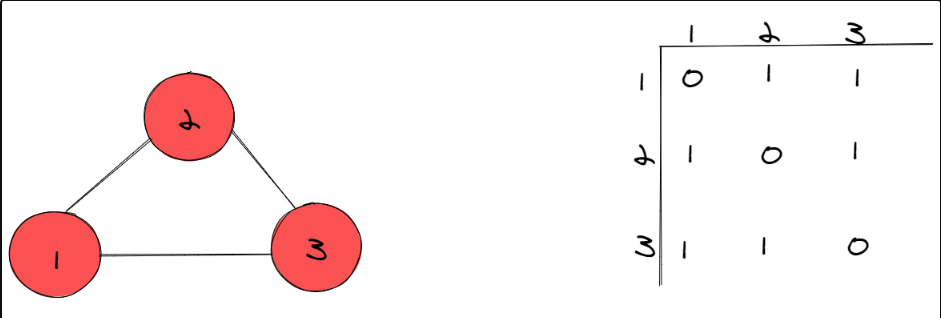
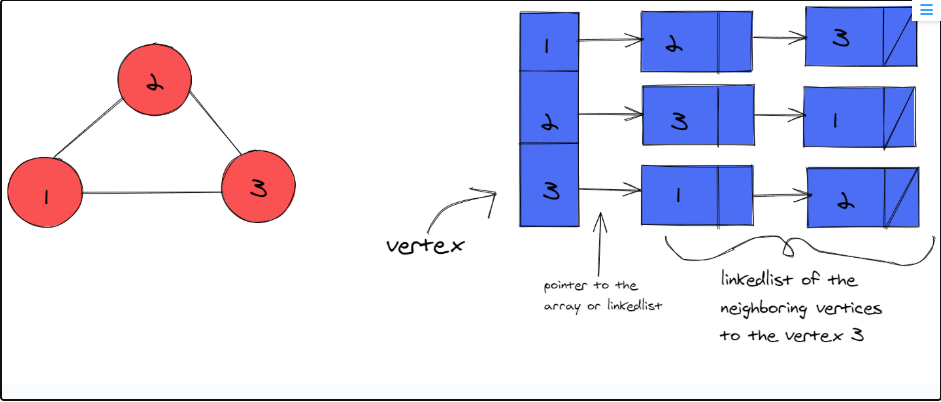

# Примеры построения графа

Graph - это программное представление связанных вещей или сущностей, которое использует узлы (точки) для представления элементов и связей (линий) между ними, известных как ребра, позволяя нам моделировать и документировать структуры или отношения, например, в социальных сетях или на веб-страницах Интернета.
В терминологии графов точки называются nodes или vertices, линии — edges, а сам граф — это структура данных, представляющая взаимосвязи; edges могут быть упорядоченными или неупорядоченными в зависимости от того, является ли граф directed или undirected, и могут иметь веса, указывающие на силу связи между вершинами.
Граф в информатике и математике состоит из двух основных компонентов: nodes/vertices — отдельных сущностей, и edges — отображающих взаимосвязи или взаимодействия между этими сущностями, с такими атрибутами, как direction и weight, указывающими на конкретные аспекты этих взаимосвязей.

### Список рёбер (Edge List)

Список рёбер — это list или array всех рёбер графа. Списки рёбер — один из самых простых способов представления графа.

В этой реализации базовая структура данных для отслеживания всех узлов и рёбер представляет собой один список пар. Каждая пара представляет собой отдельное ребро и состоит из двух уникальных идентификаторов задействованных узлов. Каждый line/edge в графе получает запись в списке рёбер, и эта единая структура данных кодирует все узлы и связи между ними.

### Матрица смежности (adjacency matrix)

Матрица смежности — это матрица, которая показывает, какие именно вершины/узлы в графе соединены рёбрами. Она служит таблицей поиска, где значение 1 указывает на существующее ребро, а 0 — на несуществующее. Индексы матрицы соответствуют узлам.

На этой иллюстрации мы видим, что в матрице смежности есть цепочка ячеек со значением 0 по диагонали. На самом деле это характерно для большинства графов, поскольку большинство из них не являются самореферентными. Другими словами, поскольку узел 2 не имеет (или не может иметь) связи с самим собой, если провести линию из столбца 2 в строку 2, значение будет равно 0.

Однако если бы мы захотели проверить, связан ли узел 3 с узлом 1, мы бы обнаружили между ними связь. Мы могли бы найти столбец 3, строку 1 и увидеть, что значение равно 1, а значит, между этими двумя узлами есть связь.

Матрицами смежности легко пользоваться и их легко представить в виде схемы. Поиск, добавление и удаление ребра можно выполнить за O(1) или constant time. Однако у них есть недостаток: они могут занимать больше места, чем необходимо. Матрица смежности всегда занимает O(V^2) (V — количество вершин) ячеек.

### Список смежности (adjacency list)

**Самый удобный и гибкий граф**

Adjacency list — это массив связанных списков, который используется для представления графа. Его уникальность заключается в том, что благодаря своей структуре он позволяет легко определить, какие вершины смежны с другими вершинами. Каждый vertex в графе может легко ссылаться на своих соседей через связанный список.

По этой причине список смежности является наиболее распространённым представлением graph. Другая причина заключается в том, что при решении задач на обход графа часто требуется легко определять, какие узлы являются соседями другого узла. В большинстве задач на обход графа, которые встречаются на собеседованиях, нам не нужно строить весь граф. Гораздо важнее знать, куда мы можем попасть (или, другими словами, кто является соседями узла).

На этой иллюстрации каждой вершине присвоен индекс в list. Все соседние вершины list хранятся в связанном списке (также может быть массивом), примыкающем к вершине.

Например, последний элемент в списке — это вершина 3, которая содержит указатель на связанный список своих соседей. Список, примыкающий к вершине 3, содержит ссылки на две другие вершины (1 и 2), которые являются двумя узлами, соединенными с узлом 3.

Таким образом, просто проверив узел 3, мы можем быстро определить, кто его соседи, и, соответственно, понять, что к нему ведут два ребра.

Все это обусловлено структурой списка смежности, которая позволяет легко определить всех соседей одной конкретной вершины. На самом деле поиск соседей одного узла занимает constant или O(1) времени, поскольку нам нужно лишь найти индекс искомого узла и извлечь список смежных вершин.
