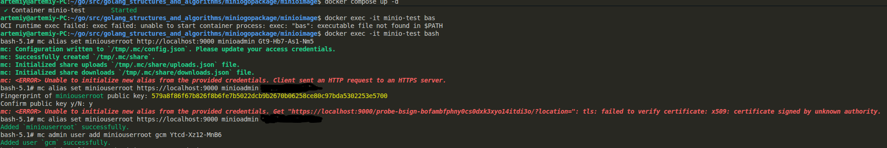
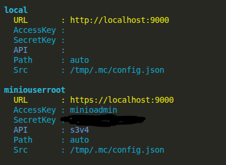

# MinIO Image

### Порядок разворачивания из docker-compose.yml

Выполнить

```bash
./gencert.sh
```

для того чтобы сгенерировать сертификат и приватный ключ

Запустить Docker

```bash
docker-compose up -d
```

Создать внутри контейнера нового пользователя для MinIO с учётными данными
из файла ../.env

```bash
docker exec -it minio-test bash
mc alias list # смотрим список доступных TARGETS
mc alias set miniouserroot https://localhost:9000 <имя root пользователя> <password> # берем имя и пароль из docker-compose.yml если нет root из docker-compose.yml, то создаём его (могут быть проблемы с сертификатом, надо попробовать несколько раз, то есть повторить команду два и более раз, обычно на второй раз команда срабатывает успешно)
mc admin user add miniouserroot <user name> <password> # создаём нового пользователя
mc admin policy attach miniouserroot readwrite --user <user_name> # добавляем политику доступа
mc admin user list miniouserroot # проверяем наличие пользователя
```



По терминологии MinIO access_key по терминологии MinIO это username, secret_key - password

### Как создать нового пользователя.

#### 1. Создаём новый alias:

```bash
mc alias set miniouserroot http://localhost:9000 admin password
```

(где miniotuserroot - псевдоним пользователя root). Создание выполняется от пользователя root, то есть под его учётными данными.



Удаление выполняется командой:

```bash
mc alias remove miniouserroot
```

#### 2. Проверить наличие alias:

```bash
mc alias ls или mc alias ls miniotuserroot
```

#### 3. После того как подключились к серверу MinIO, создаём пользователя:

```bash
mc admin user add miniouserroot testuser 123qwe123
```

#### 4. Создаём политику доступа:

```bash
mc admin policy attach miniouserroot readwrite --user gcm
```

#### 5. Теперь можно посмотреть список всех пользователей:

```bash
mc admin user list miniouserroot
```

#### 6. Смотрим информацию о пользователе:

```bash
mc admin user info miniouserroot gcm
```

#### 7. Удаление пользователя:

```bash
mc adminuser remove miniotuserroot gcm
```

#### 8. Изменение пароля пользователя:

```bash
mc admin user disable miniotuserroot gcm
```

сначала отключаем

```bash
mc admin user remove miniotuserroot gcm
```

удаляем

```bash
mc admin user add miniouserroot <пользователь> <пароль>
```

создаём нового пользователя

Включение/отключение пользователя:

```bash
mc admin user disable miniouserroot gcm
mc admin user enable miniouserroot gcm
```

MINIO сервер будет доступен на https://localhost:9900
MINIO UI интерфейс будет доступен на https://localhost:9901

```bash
# из файла docker-compose.yml
ports:
      - "9900:9000"
      - "9901:9001"
```

Авторизация в UI выполняется на основании тех учетных данных которые есть в файле .env и на основании которых был создан новый пользователь.
